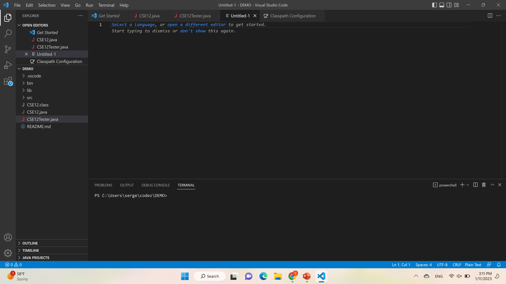

# Lab 1 report
## Installing Visual studio
* Visual studio code is a widely used IDE, which can be installed using the following link: [Link](http://a.com). I have already had it 
installed on my laptop for the previous CSE classes. Below is the screenshot of what VSCode should look like on the start up (can vary depending on OS, version etc).
For the purpose of this lab we will be working with the terminal. If it is not there upon opening VSCode, use `Ctrl+\``

