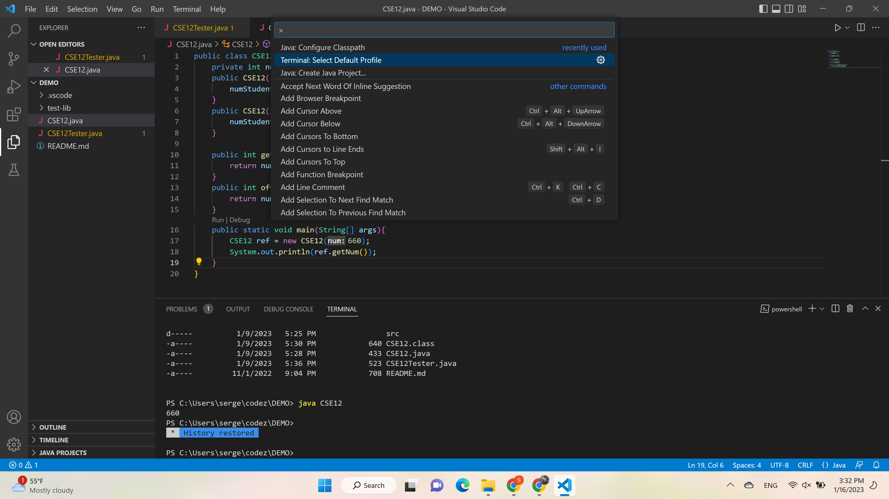
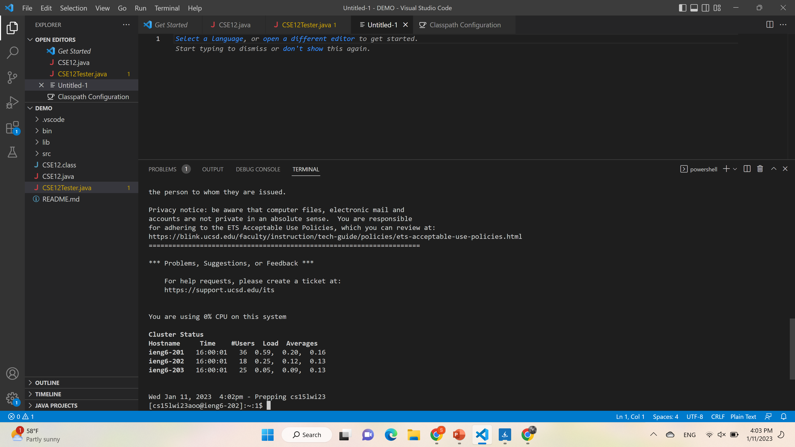
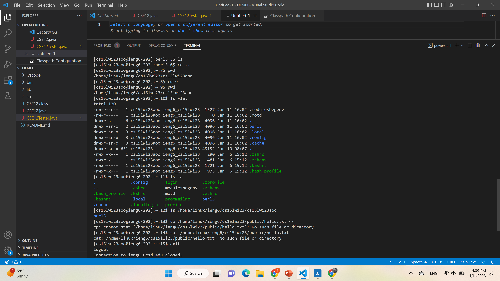

# Lab 1 report

## Installing Visual studio

* Visual studio code is a widely used IDE, which can be installed using the following link: [Link](https://code.visualstudio.com/). I have already had it 
installed on my laptop for the previous CSE classes. Below is the screenshot of what VSCode should look like on the start up (can vary depending on OS, version etc).
For the purpose of this lab we will be working with the terminal. If it is not there upon opening VSCode, use `` Ctrl+` ``

## Remotely connecting

* In order to connect to a remote server, we first need to install Git. [Link](https://gitforwindows.org/)
* After succesfully installing Git we can switch to Bash terminal in VSCode. To do so, we press 'Ctrl + Shift + P' in VSCode and then select 'Terminal: Select Default Profile'

* The next step is to connect to the UCSD remote server used for this class. The command for that is 'ssh cs15lwi23zz@ieng6.ucsd.edu' where zz should be replaced with the letters in your course-specific account (not to be confused with your ucsd email). If everything worked properly, your the terminal should look something like this:
* 

CLICK ME

 
 * If it is your fist time connecting to this server, you will see a Privacy notice - simply type yes and press enter
 * When typing the password for your account in the command prompt, it won't show up on the command line which is done for privacy purposes. Just type your password and press enter.
 * If after you typed in the password it doen't work, wait a few minutes and try again. Also make sure that you replaced zz with the letters in your account (should be a combination of two or three letters). If it still doesn't work, reset the password using the following link: [Link](https://docs.google.com/document/d/1hs7CyQeh-MdUfM9uv99i8tqfneos6Y8bDU0uhn1wqho/edit). Also, when resetting the password select the option to reset it only for the course, not for all of your UCSD related accounts.

## Trying Some Commands

