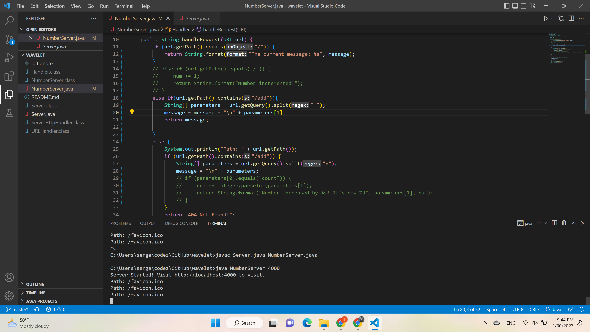
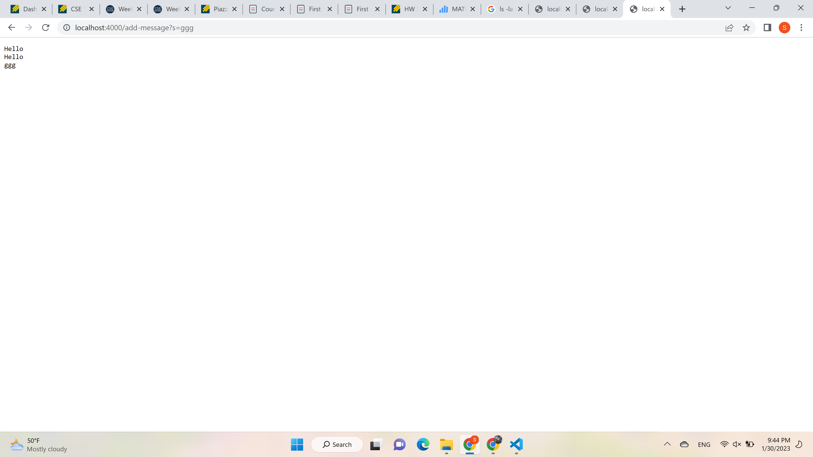
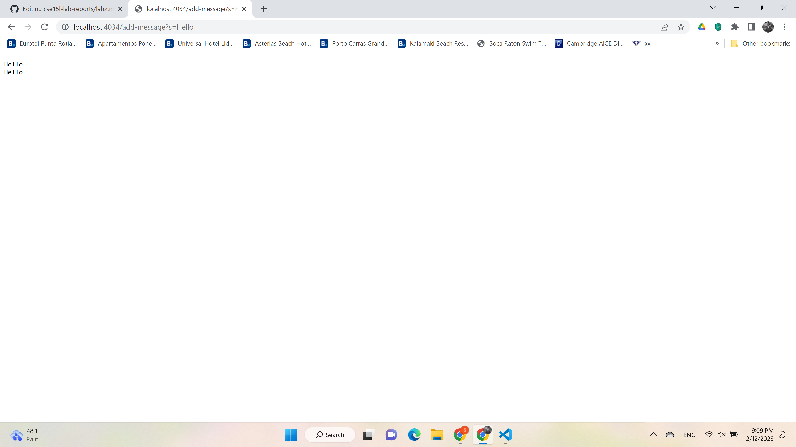
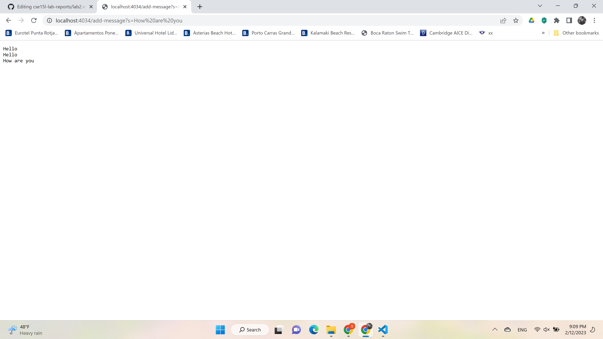
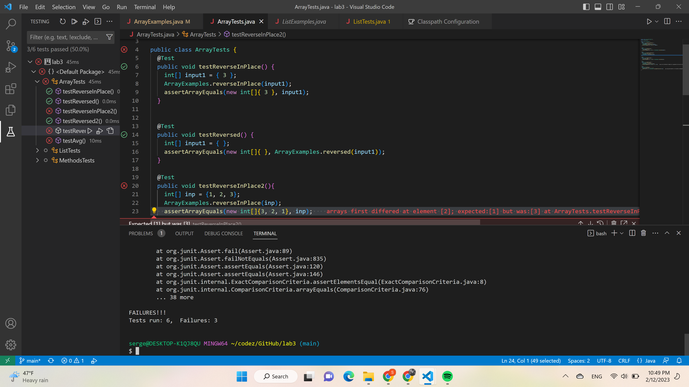

# Lab 2 report

## Part 1: Server


For the server above I modified the code we were given in the wavelet repo during lab2 in order to make the server work on string commands. In particular, I change the output of `/` path. Then I added conditional to deal with adding strings instead of integers as in the example from the lab we were given. I also changed the way content is displayed.
* Methods: the methods I modified were `getPath()`, `String.format()`, `.contains()` and `split()`
* I changed the arguments to match the strings that we are getting from the url
* I added a new datafield `message` to keep track of the strings to display and I updated it with each call to add

Below is the example of how the webpage looks like on localhost

Below are the examples of using /add-message:


* For the first screenshot, it uses the method `handleRequest()` which in turn invokes `getQuery()` and updates the datafield `message`. In the `handleRequest()` method the argument is the url from screenshot and the part of URL after `=` (Hello) obtained using `split()` method. It is added to `parameters` array and then to `message` datafield.
* For the second screenshot, it uses the method `handleRequest()` which in turn invokes `getQuery()` and updates the datafield `message`. In the `handleRequest()` method the argument is the url from screenshot and the part of URL after `=` (How are you) obtained using `split()` method. It is added to `parameters` array and then to `message` datafield.

## Part 2 (`ReverseInPlace()`)
Failure inducing input:
```
@Test
  public void testReverseInPlace2(){
    int[] inp = {1, 2, 3};
    ArrayExamples.reverseInPlace(inp);
    assertArrayEquals(new int[]{3, 2, 1}, inp);
  }
```
Input that doesn't induce failure:
```
@Test 
public void testReverseInPlace() {
    int[] input1 = { 3 };
    ArrayExamples.reverseInPlace(input1);
    assertArrayEquals(new int[]{ 3 }, input1);
}
 ```
Test output:
 

Code before fix:
```
static void reverseInPlace(int[] arr) {
    for(int i = 0; i < arr.length; i += 1) {
      arr[i] = arr[arr.length - i - 1];
    }
  }
```
After fix:
```
static void reverseInPlace(int[] arr) {
    int bp = arr.length / 2;
    for(int i = 0; i <= bp; i += 1) {
      int temp = arr[arr.length - 1 - i];
      arr[arr.length - 1 - i] = arr[i];
      arr[i] = temp;
    }
  }
```
The method used here to reverse the array can be visually described as reflecting it around the midpoint. However, the code in the initial implementation doesn't take into account the fact that the for-loop needs to stop half-way through. The new implementation fixes that issue by introducing a breakpoint halfway through the array. 


## Part 3
In the past two weeks the major new thing that I learned were webservers and ways to manipulate them using java on both local host and remote server. So far, I only new how to run programs in terminal and get outpur there. With servers, especially when you run them on a remote server, I feel like I have more opportunities available to me. Another useful thing I learned is using Github Desktop and basic github commands suh as `clone` or `push`. 
