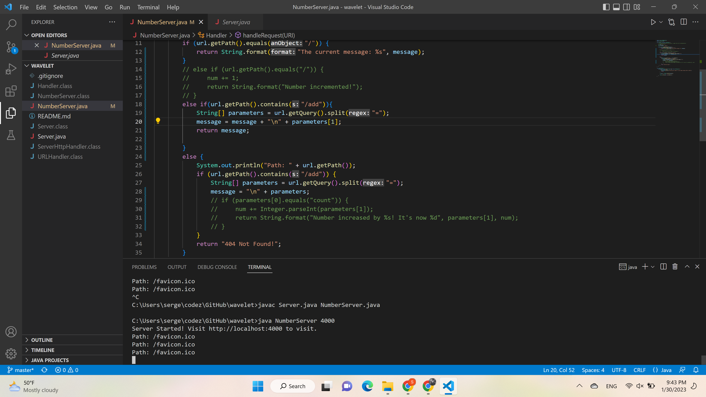
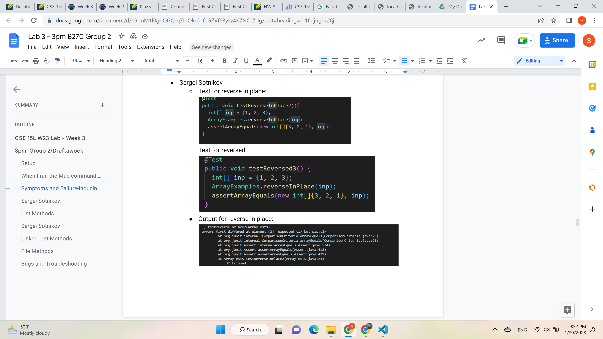

# Lab 2 report

## Server

For the server above I modified the code we were given in the wavelet repo during lab2 in order to make the server work on string commands

## Part 2

## Part 3
In the past two weeks the major new thing that I learned were webservers and ways to manipulate them using java on oth local host and remote server
