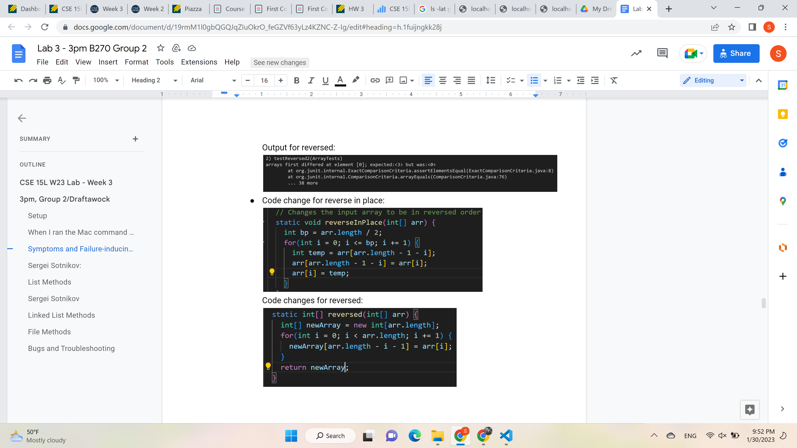

# Lab 2 report

## Part 1: Server

For the server above I modified the code we were given in the wavelet repo during lab2 in order to make the server work on string commands. In particular, I change the output of `/` path. Then I added conditional to deal with adding strings instead of integers as in the example from the lab we were given. I also changed the way content is displayed.
* Methods: the methods I modified were `getPath()`, `String.format()`, `.contains()` and `split()`
* I changed the arguments to match the strings that we are getting from the url
* I added a new datafield `message` to keep track of the strings to display and I updated it with each call to add

Below is the example of how the webpage looks like on localhost

## Part 2

## Part 3
In the past two weeks the major new thing that I learned were webservers and ways to manipulate them using java on both local host and remote server. So far, I only new how to run programs in terminal and get outpur there. With servers, especially when you run them on a remote server, I feel like I have more opportunities available to me. Another useful thing I learned is using Github Desktop and basic github commands suh as `clone` or `push`. 
