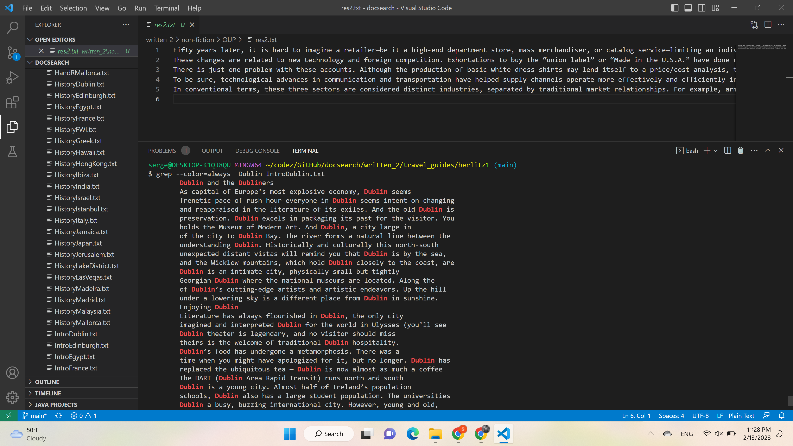
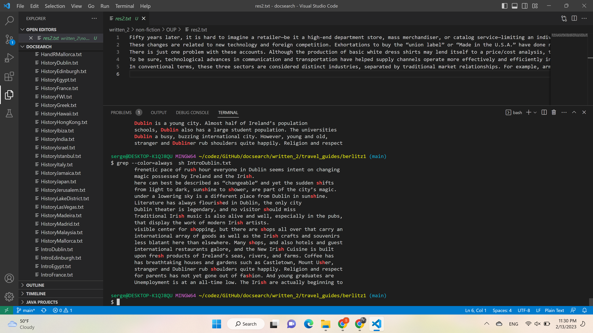

# Lab 3 report
## `grep -i`
* Ex1
```
$ grep -i "good" Abernathy/ch1.txt
Fifty years later, it is hard to imagine a retailer—be ... (the output contnues)
```
* Ex2
```
$ grep -i "word" Abernathy/ch1.txt
```
This command does case insensitive search. The second example the ouput is empty because the word was not found.

## `grep -R`
* Ex1
```
$ grep -R 'he walks'
travel_guides/berlitz1/WhereToLakeDistrict.txt:        without much exertion. The walks lie along the stream bed on a plateau
travel_guides/berlitz1/WhereToMalaysia.txt:        of the walks pass through — or close to — the Malaysian Agriculture
```
* Ex2
```
$ grep -R 'Moscow'
travel_guides/berlitz1/HistoryFrance.txt:        During his disastrous campaign in Russia, he found time in Moscow to
travel_guides/berlitz1/HistoryFrance.txt:        while a new French Communist Party, loyal to Moscow, split with the
travel_guides/berlitz1/WhereToFrance.txt:        to and from Moscow in 1812 to a splendid 4-horsepower Renault car from
```
Prints out the files in the given directory and its subdirectories that contain given word
## `grep -c`
* Ex1
```
$ grep -c 'Dublin' IntroDublin.txt
30
```
* Ex2
```
$ grep -c 'London' IntroDublin.txt
0
```
Counts how many times the string appears in the file
## `grep --color`
screenshots for color. Highlights the given string.



Resources:
* https://www.cyberciti.biz/faq/howto-use-grep-command-in-linux-unix/
* https://man7.org/linux/man-pages/man1/grep.1.html
